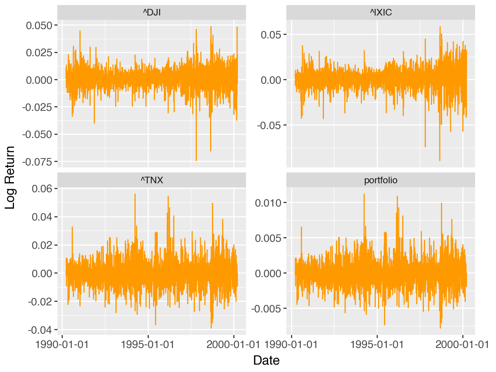
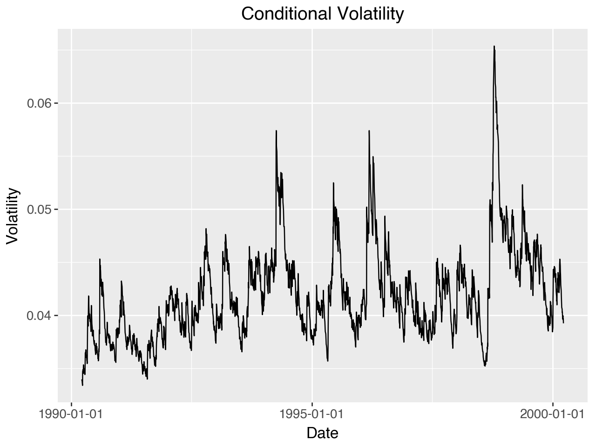
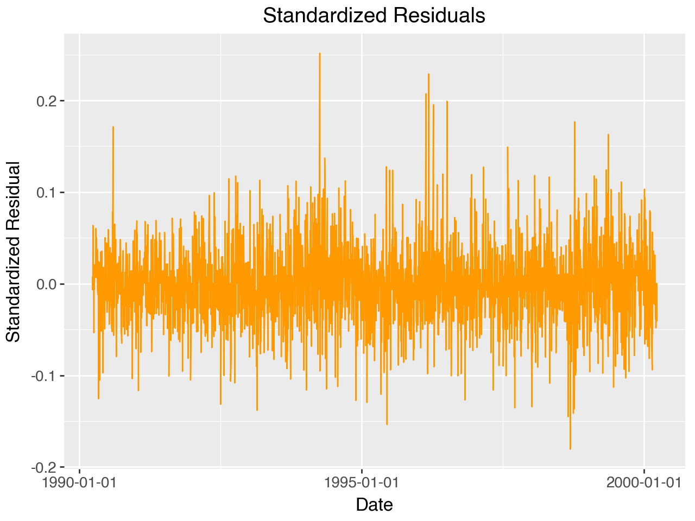
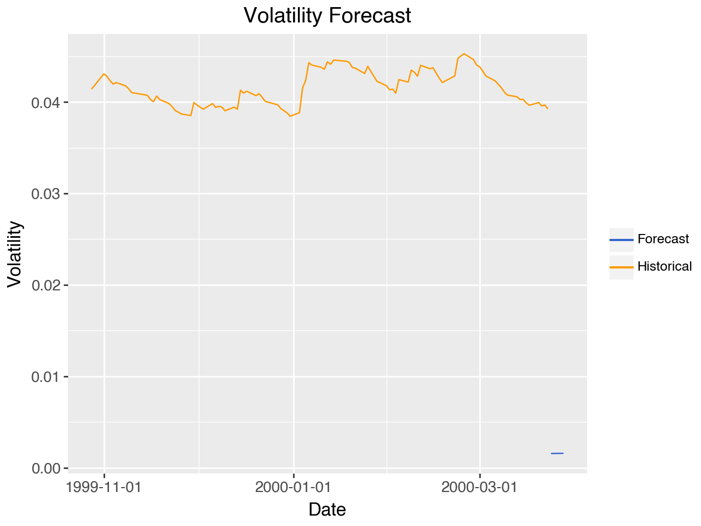

# GARCH Model Implementation
Krzysztof Wojdalski, Piotr, Shah

# Introduction

## Background

This project aims to replicate the GARCH model analysis presented in
Robert Engle’s 2001 Nobel Prize lecture, “GARCH 101: The Use of
ARCH/GARCH Models in Applied Econometrics.” The lecture demonstrates how
GARCH models can be used to analyze and forecast financial market
volatility.

### Rationale behind the Study

1)  From the initial inspection of the article, easy to obtain data
2)  Well-known author so we asssumed that the methodology is sound and
    well-explained
3)  The author’s research has had significant influence and impact in
    the field of time series analysis
4)  Research could be easily extended for different datasets /
    portfolios

### Steps in the Research

The replication focuses on the following:

1.  Constructing a portfolio similar (or, hopefully, identical) to the
    one used in Engle’s paper
2.  Calculating and analyzing portfolio returns
3.  Fitting a GARCH(1,1) model to the portfolio returns
4.  Examining the model’s performance in capturing volatility clustering
5.  Generating volatility forecasts in the same manner as Engle did

By following Engle’s methodology, the project provides a practical
implementation of GARCH modeling techniques for financial time series
analysis.

# Imports and Setup

``` python
import logging
import os
from datetime import datetime

import numpy as np
import pandas as pd
from plotnine import (
    aes,
    element_blank,
    element_text,
    facet_wrap,
    geom_line,
    ggplot,
    labs,
    scale_color_manual,
    theme,
)

if os.getcwd().endswith("src") or os.getcwd().endswith("notebooks"):
    os.chdir("..")

from src.utils import (
    calculate_acf_table,
    calculate_portfolio_stats,
    calculate_returns,
    fetch_stock_data,
    fit_garch,
    plot_volatility,
)

# Configure logging
logging.basicConfig(
    level=logging.INFO, format="%(asctime)s - %(levelname)s - %(message)s"
)
logger = logging.getLogger(__name__)
```

# Data Preparation

## Portfolio Composition

This portfolio consists of:

- 50% Nasdaq (^IXIC)
- 30% Dow Jones Industrial Average (^DJI)
- 20% 10-year Treasury Constant Maturity Rate [^1]

#### Problems with the data

Engle described the data set as follows:

> Let’s use the GARCH(1,1) tools to estimate the 1 percent value at risk
> of a \$1,000,000 portfolio on March 23, 2000. This portfolio consists
> of 50 percent Nasdaq, 30 percent DowJones and 20 percent long bonds.
> The long bond is a ten-year constant maturity Treasury. The portfolio
> has constant proportions of wealth in each asset that would entail
> some rebalancing over time.

Due to vagueness of the claim above, we’ll try to reverse engineer the
portfolio, but it’s not a perfect solution. When we calculate return on
the portfolio, we implictly assume daily rebalancing, i.e., weights are
constant.

## Fetching Stock Data

We’ll fetch the portfolio components data using the implemented
function:

- The function is implemented in `src/utils.py`
- it uses `yfinance` - a Python package for downloading stock data from
  Yahoo Finance
- start and end dates are taken from the article
- weights for portfolio components are taken from the article, i.e. 50%
  Nasdaq, 30% Dow Jones, and 20% 10-year Treasury.

``` python
# Parameters
# Nasdaq, Dow Jones, and 10-year Treasury
symbols = ["^IXIC", "^DJI", "^TNX"]  #
# Define the date range, based on the paper
# Sample period
start_date = datetime(1990, 3, 22)
end_date = datetime(2000, 3, 24)

# Portfolio weights, taken from the article
weights = {
    "^IXIC": 0.50,  # Nasdaq
    "^DJI": 0.30,  # Dow Jones
    "^TNX": 0.20,  # 10-year Treasury
}


# Fetch data using our implementation
logger.info("Fetching data...")
prices = fetch_stock_data(symbols, start_date, end_date)

# Display the first few rows
prices.tail()

# Apparently, DJIA data is missing for 1990-1992, so we'll drop it
prices = prices.drop(columns=["^DJI", "^TNX"])
```

### RATE and Dow Jones Industrial Average (^DJI)

As the data for `^DJI` was missing for 1990-1992, we had to take it from
somewhere else. We found Dow Jones Industrial Average (^DJI) data
[here](https://www.kaggle.com/datasets/shiveshprakash/34-year-daily-stock-data).

For RATE we used a good proxy which we found here looks like a good
proxy for TNX, we’ll use data we found
[here](https://fred.stlouisfed.org/graph/fredgraph.csv?bgcolor=%23ebf3fb&chart_type=line&drp=0&fo=open%20sans&graph_bgcolor=%23ffffff&height=450&mode=fred&recession_bars=on&txtcolor=%23444444&ts=12&tts=12&width=1320&nt=0&thu=0&trc=0&show_legend=yes&show_axis_titles=yes&show_tooltip=yes&id=DGS10&scale=left&cosd=2020-04-17&coed=2025-04-17&line_color=%230073e6&link_values=false&line_style=solid&mark_type=none&mw=3&lw=3&ost=-99999&oet=99999&mma=0&fml=a&fq=Daily&fam=avg&fgst=liin&fgsnd=2020-02-01&line_index=1&transformation=lin&vintage_date=2025-04-22&revision_date=2025-04-22&nd=1962-01-02)

#### DJIA data retrieval

``` python
djia_prices = pd.read_csv(
    "data/dja-performance-report-daily.csv",
    index_col="Effective Date",
    parse_dates=True,
)
djia_prices = djia_prices.rename(columns={"Close Value": "^DJI"})
prices = prices.join(djia_prices["^DJI"])
```

#### RATE data retrieval

Data has been obtained from the hyperlink

``` python
tnote_yield = pd.read_csv(
    "data/DGS10.csv",
    index_col="observation_date",
    parse_dates=True,
)
tnote_yield = tnote_yield.rename(columns={"DGS10": "^TNX"})

# tnote yield is not exactly the price, but we merge it anyway
prices = prices.join(tnote_yield["^TNX"])
```

## Calculating Returns

This function uses log returns, which are calculated as follows:

$$r_t = \ln \left( \frac{P_t}{P_{t-1}} \right)$$

where $P_t$ is the price at time $t$.

``` python
returns = calculate_returns(prices)

portfolio_prices = pd.Series(0, index=prices.index, dtype=float)

# Apply weights to each component
for symbol, weight in weights.items():
    # Use pandas multiplication and addition
    portfolio_returns = portfolio_prices.add(returns[symbol].multiply(weight))

# Add portfolio returns to the returns DataFrame
returns["portfolio"] = portfolio_returns
```

## Visualizing Price and Returns

Let’s visualize prices (excl. portfolio) and returns for all data series
and compare with the plot from the article.

Visual inspection of the plot below shows that the data is very similar
to the one in the article. The only difference is `^TNX` which doesn’t
overlap perfectly with plots from the article (could be easily spotted
by looking at the outliers.)

Possible explanation: The 10-year Treasury Constant Maturity Rate (^TNX)
is a model-derived value rather than an actual market price. Since new
10-year Treasury bonds aren’t issued daily, the constant maturity yield
represents a theoretical value of what a 10-year Treasury security would
yield if issued at current market conditions. This value is calculated
through interpolation of yields from Treasury securities with similar
credit quality but different maturities. While this approximation
closely tracks what an actual new 10-year bond would yield, small
discrepancies can exist. Nevertheless, the constant maturity rate
provides valuable insights into market expectations regarding inflation,
economic growth, and future interest rates.

Hence, it’s likely that Engle’s methodology and / or selection of the
securities with the same level of credit riskiness is different than the
one used by Federal Reserve Bank of St. Louis in 2025.

``` python
prices_df = pd.DataFrame(prices).reset_index()
prices_df = pd.melt(
    prices_df, id_vars=["Date"], var_name="Symbol", value_name="Price"
)
prices_plot = (
    ggplot(prices_df, aes(x="Date", y="Price", color="Symbol"))
    + facet_wrap("Symbol", scales="free_y", ncol=1)
    + geom_line(color="#FF9900")
    + labs(title="", x="Date", y="Price")
)
prices_plot
```

<div id="fig-prices">


Figure 1: Sample: March 23, 1990 to March 23, 2000.

</div>

Nasdaq, Dow Jones and Bond Prices

#### Returns from the original paper (for reference)


``` python
returns_df = pd.DataFrame(returns).reset_index()
returns_df = pd.melt(
    returns_df, id_vars=["Date"], var_name="Symbol", value_name="Return"
)
returns_plot = (
    ggplot(returns_df, aes(x="Date", y="Return", color="Symbol"))
    + facet_wrap("Symbol", scales="free_y")
    + geom_line(color="#FF9900")
    + labs(title="", x="Date", y="Log Return")
    + theme(
        plot_title=element_text(size=14, face="bold"),
        axis_title=element_text(size=12),
        axis_text=element_text(size=10),
    )
)


returns_plot
```

<div id="fig-returns">



Figure 2: Sample: March 23, 1990 to March 23, 2000.

</div>

Nasdaq, Dow Jones and Bond Returns

## Portfolio Statistics

It must be stated that as the input for the data is slightly different
(inadequate information), all data further on is going to be different
than the one in the article. We will attempt to compare it, though.

#### Article Portfolio Statistics (for reference)


``` python
portfolio_stats = calculate_portfolio_stats(returns)
portfolio_stats
```

<div id="tbl-portfolio-stats">

Table 1: Portfolio Statistics

<div class="cell-output cell-output-display" execution_count="23">

<div>
<style scoped>
    .dataframe tbody tr th:only-of-type {
        vertical-align: middle;
    }
&#10;    .dataframe tbody tr th {
        vertical-align: top;
    }
&#10;    .dataframe thead th {
        text-align: right;
    }
</style>

|           | ^IXIC   | ^DJI    | ^TNX    | portfolio |
|-----------|---------|---------|---------|-----------|
| Mean      | 0.0010  | 0.0006  | -0.0001 | -0.0000   |
| Std. Dev. | 0.0117  | 0.0091  | 0.0091  | 0.0018    |
| Skewness  | -0.5298 | -0.3465 | 0.3828  | 0.3828    |
| Kurtosis  | 7.4093  | 8.1301  | 5.9589  | 5.9589    |

</div>

</div>

</div>

The table above shows the summary statistics for our portfolio
components and the overall portfolio. The statistics include mean
returns, standard deviation, skewness, and kurtosis for each component.

Our results show minor differences compared to Table 1 in Engle (2001):

- The statistics for Nasdaq (^IXIC) and Dow Jones (^DJI) differ by only
  1-2 basis points
- Larger discrepancies appear for the Rate component, likely because the
  article lacks specificity about the exact data source used
  - The most notable differences are in skewness (0.38 vs -0.20) and
    kurtosis (4.96 vs 5.96)
- These differences in the Rate component are the primary reason for the
  slight variation between our replicated portfolio and the one
  presented in the paper

## ACF of Squared Portfolio Returns

The goal of running the autocorrelation function (ACF) for squared
returns is to detect volatility clustering. Significance in
autocorrelations in squared returns indicate that large changes tend to
be followed by large changes (of either sign) and small changes tend to
be followed by small changes, which is a key characteristic of GARCH
models.

#### Article ACF of Squared Portfolio Returns (for reference)


``` python
acf_plot = calculate_acf_table(returns["portfolio"])
acf_plot
```

<div id="tbl-portfolio-returns">

Table 2: Autocorrelations of Squared Portfolio Returns

<div class="cell-output cell-output-display" execution_count="24">

<div>
<style scoped>
    .dataframe tbody tr th:only-of-type {
        vertical-align: middle;
    }
&#10;    .dataframe tbody tr th {
        vertical-align: top;
    }
&#10;    .dataframe thead th {
        text-align: right;
    }
</style>

|     | AC    | Q-Stat  | Prob |
|-----|-------|---------|------|
| 1   | 0.132 | 43.421  | 0.0  |
| 2   | 0.107 | 71.818  | 0.0  |
| 3   | 0.076 | 86.103  | 0.0  |
| 4   | 0.115 | 118.744 | 0.0  |
| 5   | 0.090 | 138.847 | 0.0  |
| 6   | 0.084 | 156.263 | 0.0  |
| 7   | 0.059 | 165.049 | 0.0  |
| 8   | 0.042 | 169.422 | 0.0  |
| 9   | 0.058 | 177.757 | 0.0  |
| 10  | 0.065 | 188.176 | 0.0  |
| 11  | 0.052 | 194.828 | 0.0  |
| 12  | 0.021 | 195.885 | 0.0  |
| 13  | 0.133 | 239.635 | 0.0  |
| 14  | 0.082 | 256.293 | 0.0  |
| 15  | 0.076 | 270.829 | 0.0  |

</div>

</div>

</div>

# GARCH Model

## Model Specification

The GARCH(1,1) model is given as:

$$\sigma_t^2 = \omega + \alpha_1 \varepsilon_{t-1}^2 + \beta_1 \sigma_{t-1}^2$$

where:

- $\sigma_t^2$ is the conditional variance
- $\omega$ is the constant term
- $\alpha_1$ is the ARCH effect
- $\beta_1$ is the GARCH effect
- $\varepsilon_{t-1}^2$ is the squared lagged returns
- $\sigma_{t-1}^2$ is the lagged conditional variance

## GARCH Model Estimation

### Fitting the GARCH(1,1) Model

Now we’ll fit a GARCH(1,1) model to the returns and retrieve values of
the coefficients with their standard errors, z-statistics, and p-values.

As we can see, the output from the article is similar to the one we got.

#### Article GARCH(1,1) Model (for reference)


``` python
logger.info("Fitting GARCH(1,1) model...")
results = fit_garch(returns["portfolio"])

logger.info(results.summary())
# Extract coefficients, standard errors, z-statistics, and p-values
coef = results.params
std_err = results.std_err
z_stat = coef / std_err
p_values = results.pvalues

# Create a DataFrame to display the results
model_results = pd.DataFrame(
    {
        "Coef": coef,
        "St. Err": std_err,
        "Z-Stat": z_stat,
        "P-Value": p_values,
    }
)
model_results
```

<div id="tbl-garch-one-one">

Table 3: GARCH(1,1)

<div class="cell-output cell-output-display" execution_count="25">

<div>
<style scoped>
    .dataframe tbody tr th:only-of-type {
        vertical-align: middle;
    }
&#10;    .dataframe tbody tr th {
        vertical-align: top;
    }
&#10;    .dataframe thead th {
        text-align: right;
    }
</style>

|            | Coef          | St. Err      | Z-Stat      | P-Value  |
|------------|---------------|--------------|-------------|----------|
| mu         | -1.702823e-05 | 8.923329e-08 | -190.828272 | 0.000000 |
| omega      | 6.637798e-08  | 1.019923e-11 | 6508.139643 | 0.000000 |
| alpha\[1\] | 5.000000e-02  | 1.069379e-02 | 4.675609    | 0.000003 |
| beta\[1\]  | 9.300000e-01  | 9.543193e-03 | 97.451660   | 0.000000 |

</div>

</div>

</div>

## ACF of Squared Standardized Residuals

Section examines the autocorrelation function (ACF) of squared
standardized residuals from the model. ACF helps us check if our model
has successfully captured volatility clustering in the data.

If the model is well-specified, these squared standardized residuals
should show no significant autocorrelation, indicating that no
predictable volatility patterns remain unexplained by the model.

#### Article ACF of Squared Standardized Residuals (for reference)


``` python
acf_plot = calculate_acf_table(results.resid / np.sqrt(results.conditional_volatility))
acf_plot
```

<div id="tbl-squared-residuals">

Table 4: Autocorrelations of Squared Standardized Residuals

<div class="cell-output cell-output-display" execution_count="26">

<div>
<style scoped>
    .dataframe tbody tr th:only-of-type {
        vertical-align: middle;
    }
&#10;    .dataframe tbody tr th {
        vertical-align: top;
    }
&#10;    .dataframe thead th {
        text-align: right;
    }
</style>

|     | AC     | Q-Stat | Prob  |
|-----|--------|--------|-------|
| 1   | 0.029  | 2.148  | 0.143 |
| 2   | 0.032  | 4.670  | 0.097 |
| 3   | 0.003  | 4.699  | 0.195 |
| 4   | 0.042  | 8.984  | 0.061 |
| 5   | 0.036  | 12.178 | 0.032 |
| 6   | 0.027  | 14.040 | 0.029 |
| 7   | -0.003 | 14.059 | 0.050 |
| 8   | 0.009  | 14.270 | 0.075 |
| 9   | 0.021  | 15.390 | 0.081 |
| 10  | 0.024  | 16.782 | 0.079 |
| 11  | 0.014  | 17.253 | 0.101 |
| 12  | -0.015 | 17.787 | 0.122 |
| 13  | 0.097  | 41.231 | 0.000 |
| 14  | 0.041  | 45.355 | 0.000 |
| 15  | 0.035  | 48.357 | 0.000 |

</div>

</div>

</div>

# Volatility Analysis

## Conditional Volatility

Let’s plot the conditional volatility using our implementation:

``` python
volatility_plot = plot_volatility(results, returns)
volatility_plot
```

<div id="fig-conditional-volatility">



Figure 3: Conditional Volatility

</div>

## Model Diagnostics

Let’s examine the model residuals using plotnine:

``` python
# Get standardized residuals
std_resid = results.resid / np.sqrt(results.conditional_volatility)

# Create dataframe for residuals
resid_df = pd.DataFrame({"Date": std_resid.index, "Residual": std_resid.values})

# Create residuals plot
resid_plot = (
    ggplot(resid_df, aes(x="Date", y="Residual"))
    + geom_line(color="#FF9900")
    + labs(title="Standardized Residuals", x="Date", y="Standardized Residual")
    + theme(
        plot_title=element_text(size=14, face="bold"),
        axis_title=element_text(size=12),
        axis_text=element_text(size=10),
    )
)

resid_plot
```



# Volatility Forecasting

## Generating Forecasts

Let’s generate volatility forecasts:

``` python
# Generate forecasts
logger.info("Generating volatility forecast...")
forecast = results.forecast(horizon=5)
logger.info("\nVolatility Forecast:")
logger.info(forecast.variance.iloc[-1])
```

## Visualizing Forecasts

Let’s visualize the forecast using plotnine:

``` python
# Create dataframes for historical and forecast data
historical_df = pd.DataFrame(
    {
        "Date": returns.index[-100:],
        "Volatility": np.sqrt(results.conditional_volatility[-100:]),
        "Type": "Historical",
    }
)

forecast_dates = pd.date_range(returns.index[-1], periods=6)[1:]
forecast_df = pd.DataFrame(
    {
        "Date": forecast_dates,
        "Volatility": np.sqrt(forecast.variance.iloc[-1]),
        "Type": "Forecast",
    }
)

# Combine dataframes
combined_df = pd.concat([historical_df, forecast_df])

# Create forecast plot
forecast_plot = (
    ggplot(combined_df, aes(x="Date", y="Volatility", color="Type"))
    + geom_line()
    + labs(title="Volatility Forecast", x="Date", y="Volatility")
    + scale_color_manual(values=["#3366CC", "#FF9900"])
    + theme(
        plot_title=element_text(size=14, face="bold"),
        axis_title=element_text(size=12),
        axis_text=element_text(size=10),
        legend_title=element_blank(),
    )
)

# Display plot
forecast_plot
```

<div id="fig-forecast">



Figure 4: Volatility Forecast

</div>

# References

- Engle, R. F. (2001). GARCH 101: The Use of ARCH/GARCH Models in
  Applied Econometrics. Journal of Economic Perspectives, 15(4),
  157-168.
- Kaggle. (2023). Dow Jones Industrial Average (^DJI) Data. \[Dataset\].
  Available at:
  https://www.kaggle.com/datasets/shiveshprakash/34-year-daily-stock-data
- St. Louis Fed. (2023). 10-Year Treasury Constant Maturity Rate
  \[^TNX\]. \[Dataset\]. Available at:
  https://fred.stlouisfed.org/graph/fredgraph.csv?bgcolor=%23ebf3fb&chart_type=line&drp=0&fo=open%20sans&graph_bgcolor=%23ffffff&height=450&mode=fred&recession_bars=on&txtcolor=%23444444&ts=12&tts=12&width=1320&nt=0&thu=0&trc=0&show_legend=yes&show_axis_titles=yes&show_tooltip=yes&id=DGS10&scale=left&cosd=2020-04-17&coed=2025-04-17&line_color=%230073e6&link_values=false&line_style=solid&mark_type=none&mw=3&lw=3&ost=-99999&oet=99999&mma=0&fml=a&fq=Daily&fam=avg&fgst=liin&fgsnd=2020-02-01&line_index=1&transformation=lin&vintage_date=2025-04-22&revision_date=2025-04-22&nd=1962-01-02
- Yahoo Finance. (2023). \[Dataset\]. Available at:
  https://finance.yahoo.com/quote/%5EIXIC/history?period1=631152000&period2=1713878400&interval=1d&filter=history&frequency=1d&includeAdjustedClose=true
- GenAI used for proof checking and type hinting

[^1]: Potentially ^TNX, this needs to be checked further on.
